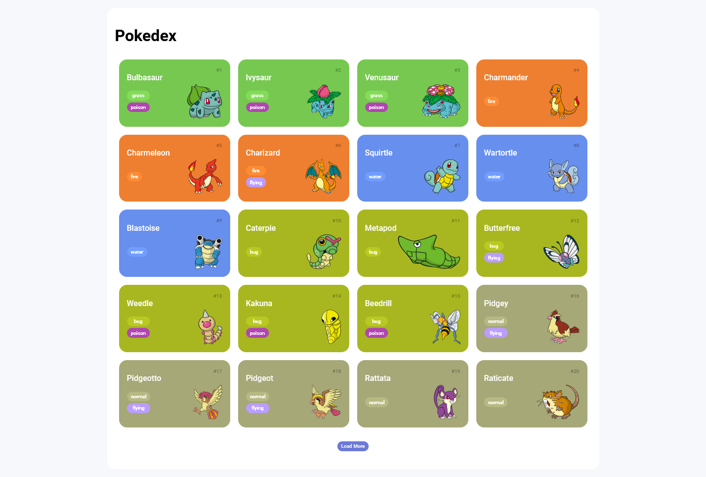

# 🐱 Pokedex

## 📃 Descrição

Este projeto é baseado em uma _Pokédex_, que mostra todos os Pokémons da primeira geração. A requisição é efetuado utilizando a `fetch API`, consumindo a API `pokeapi.co` para trazer as informações dos Pokémons. Esse foi o resultado do desafio fornecido na plataforma da [DIO.me](dio.me).

## 📝 Anotações

### Aprendizados

- **CSS**
  - A importância do `normalize CSS`
  - O conceito `Mobile First`
  - Os displays `Grid Layout` e `Flexbox`
- **Javascript**
  - Função `map()` para criar uma lista a partir de outra lista de forma eficiente
  - Função `join()` para transformar listas em strings
  - Uso da `fetch API` para efetuar as requisições
- **Requisição HTTP**
  - `URL` como `Endereço` / `Caminho`
  - `Request Methods` que pode ser `POST`, `GET`, `PUT` ou `DELETE`, além de vários outros tipos
  - `Path Params` e `Query Strings`
  - `Request Headers` que é o cabeçalho da requisição
  - `Request Body` que é o corpo de alguns tipos de requisição
  - `Status Code` que indica o que houve com a requisição

## 🖼️ Imagem do site (desatualizada)

## ✨ Atualizações

- O código do site foi polido, incluíndo refatorações e correção de bugs.
- O design da página e dos cards foi melhorado, com a adição de novas animações, interações e cores.
- Agora é possível navegar por todo o site utilizando apenas o teclado.
- Favicon de uma Pokébola adicionado.

## 🔗 Links

- [Digital Innovation One](https://www.dio.me/)
- [Fetch API | MDN](https://developer.mozilla.org/en-US/docs/Web/API/Fetch_API)
- [Ícone Pokébola colorida](https://www.svgrepo.com/svg/276264/pokeball-pokemon)
- [Ícone Pokébola preta](https://www.svgrepo.com/svg/370529/pokeball)
- [Ícone LinkedIn](https://www.svgrepo.com/svg/106639/linkedin-logo)
- [Ícone Repositório](https://www.svgrepo.com/svg/358746/repository-submodule)
- [Ícone GitHub](https://www.svgrepo.com/svg/512317/github-142)
- [Pokeapi](https://pokeapi.co/)
- [Repositório base do projeto](https://github.com/digitalinnovationone/js-developer-pokedex)
